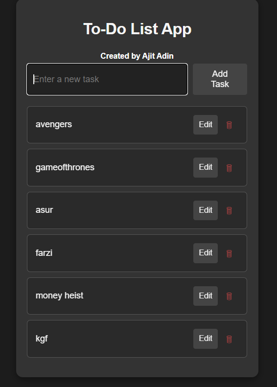

```markdown
# Movie List App

## Overview

The **Movie List App** is a web application built using Node.js, Express, and MongoDB, designed to help users manage their movie collections. Users can add, view, and manage their favorite films easily with a simple and intuitive interface.

## Features

- **Add Movies**: Users can input details about movies, including title, release date, genre, director, and cast.
- **View Movies**: A list displays all movies added by the user.
- **Responsive Design**: Built with Bootstrap for a mobile-friendly interface.

## Technologies Used

- **Node.js**: JavaScript runtime for server-side development.
- **Express**: A web framework for building web applications and APIs.
- **MongoDB**: A NoSQL database for storing movie data.
- **JavaScript**: Used for both client-side and server-side programming.
- **HTML/CSS**: To structure and style the application.

## Getting Started

### Prerequisites

Ensure you have the following installed on your machine:

- [Node.js](https://nodejs.org/)
- [MongoDB](https://www.mongodb.com/)

### Installation

1. **Clone the repository**:

   ```bash
   git clone https://github.com/your-username/movie-list-app.git
   ```

2. **Navigate into the project directory**:

   ```bash
   cd movie-list-app
   ```

3. **Install the required dependencies**:

   ```bash
   npm install
   ```

4. **Set up your MongoDB connection**:
   - Create a `.env` file in the root directory and add your MongoDB connection string:

   ```plaintext
   MONGODB_URI=your_mongodb_connection_string
   ```

5. **Start the server**:

   ```bash
   npm start
   ```

   The server will run on `http://localhost:3000`.

## Usage

Once the server is running, open your web browser and navigate to `http://localhost:3000` to use the application. You can add movies using the form, and they will be displayed in the movie list below.

## Screenshots

Here is a screenshot of the Movie List App:



## License

This project is licensed under the MIT License. See the [LICENSE](LICENSE) file for details.

## Acknowledgements

- [Node.js](https://nodejs.org/)
- [Express](https://expressjs.com/)
- [MongoDB](https://www.mongodb.com/)
- [Bootstrap](https://getbootstrap.com/)
```

